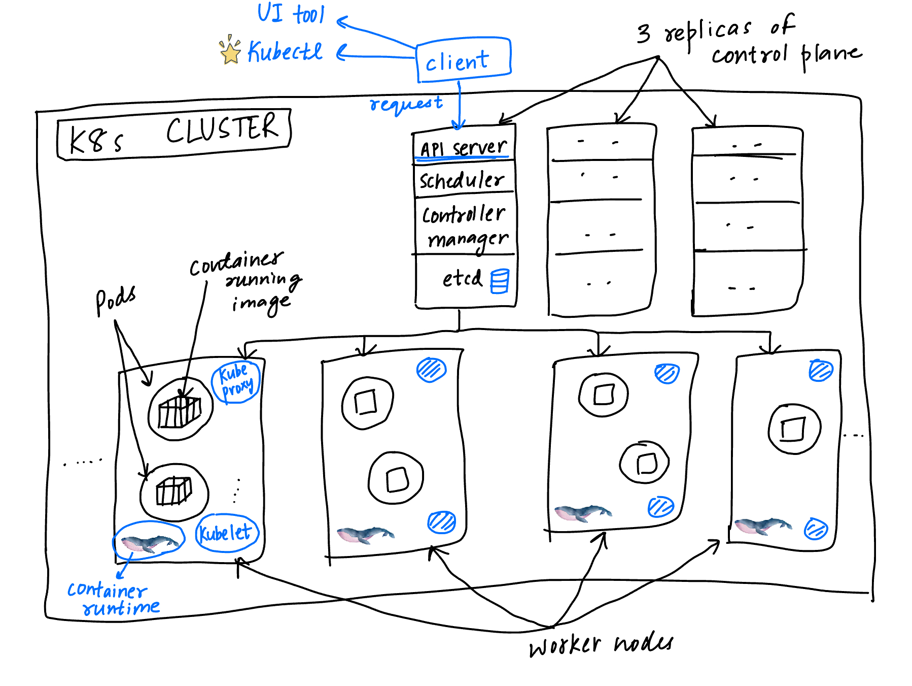

# Kubernetes

## Points to discuss

1. What is Kubernetes
2. K8s architecture
3. Main K8s components
4. Minikube and Kubectl - Local setup
5. Main Kubectl commands - K8s CLI
6. K8s YAML configuration file
7. K8s Namespaces - organize your components
8. K8s Ingress
9. Helm - Package manager
10. Volumes - Persisting data in K8s
11. The StatefulSet - Deploying Stateful apps
12. K8s services

## Need of Kubernetes

It’s a **container orchestration tool**. Rise of monolith to microservices architecture led to rise in usage of containers but maintaining those thousands of containers was not easy so we wanted an orchestration tool like Kubernetes. It has 3 advantages➖

1. High availability and downtime
2. Scaling and high performance
3. Disaster recovery - backup

## Kubernetes Components

### Node and Pods

A **node/worker node** is simply a server or a VM on which you app container would run.

**Pod** is the smallest unit of K8s and is an abstraction over the container. It means that regardless of which container like Docker you are using to run your app we will only interact with the Kubernetes layer i.e. the at the Pod level.

### Service and Ingress

Now each Pod has an IP address with which it can communicate with the other Pods. But if somehow a Pod dies due to some app failure then in that case we have to replace it with another pod with a different ip which complicates things since we have to connect with that pod again and again using a different ip. So to remove that issue we have a permanent ip address solution called as a **service**. Since lifecycle of a service has no connection with the pod the endpoints remain the same.

Now to connect from the browser to this app running on the node we need an **external service** like this `http://node-ip:node-port` but this is not good for the end product so instead we want a service like this `https://domain-name` which is easier to remember. So we use **Ingress** to make a request on this url and it then does port forwarding accordingly.

Also we don’t want to connect to a Pod that runs our database or something confidential on a public request hence for it we have an **internal service**.

<figure><figcaption><p>Service to connect with pod containers</p></figcaption></figure>

### ConfigMap and Secret

Let’s say there’s an app running inside your Pod which has access to another Pod running your database using its service. Now if by any chance that service endpoint changes then we would have to make those changes for the url in the app itself and rebuild the image and again deploy it to the repository to finally run it. This is a tedious task since the url is generally available inside the build image only.

So to avoid this we have an external config inside the node which is called **ConfigMap** that has the service url you need and you can access it as an env variable or a properties file inside your pod. But this is not useful for storing passwords or any information that should be hidden from users since the ConfigMap has textual information not encoded in any form. Hence for that reason we have another config called **Secrets** which is base64 encoded and is used to store the secret information like passwords needed by your pod.

### Volumes

If database pod is restarted it will lose all its logged data and hence we need a way to persist it. So we use volumes which are either local meaning we have a replica of the pod data inside the K8s cluster on some hard drive or we have some remote storage option where the data is being stored outside the cluster maybe using some cloud service, etc. So basically K8s doesn’t manage your data instead you are the one responsible for handling it.

<figure><figcaption><p>Using volumes to persist data</p></figcaption></figure>

### Deployment and StatefulSet

If your app fails due to some unknown reason then in that case we have to create a backup such that users can still access the app. For this reason we have a replica of the pod in another node to which our service will connect since service also behaves as a **load balancer**.

This replica is maintained/created with the help of deployments. **Deployment** is an abstraction of pods hence we can say that we don’t directly interact with pods but instead create deployments that will create pods for us. In the deployment we can specify how many replicas of the pods we need. Deployment can also be considered as a blueprint for pods.

Now what if the DB fails. In that case also we need a replica but it’s not easy to maintain it since both will have access to the persistent data being stored in our cluster we have to manage synchronisation and hence we use **StatefulSet** instead of deployments.

StatefulSet for stateful apps or databases. Whereas we use Deployments for stateless apps. But since using StatefulSet is not that easy hence we prefer keeping database out of the K8s cluster so that we only have to rely on Deployments for creating the replica sets for our stateless apps.

<figure><figcaption><p>Replicaset created with deployment</p></figcaption></figure>

## K8s architecture

In each **worker node** we observe the following➖

1. It can have multiple pods running on it.
2. It has 3 processes installed mandatorily:

* **Container runtime** - Like docker which is actually running our image inside the pod
* **Kubelet** - It’s a Kubernetes process that is responsible for handling interaction between the node and the container runtime. It’s the one that starts the pod with a container inside. Assigning resources like CPU, RAM from node to that pod running container inside.
* **Kube proxy -** it has an intelligent forwarding logic inside which makes sure that the requests that are being forwarded to the pods are using less network overhead like for example if a pod has to connect to another pod providing DB service we need to check if it’s available on the same node or not. This makes sure that the service is not forwarding requests blindly to whatever pod replica is available.

In each master node also now called as the **control plane** we observe the following➖

1. It is the one with which we interact to connect to our cluster. We can use a client like Kubernetes dashboard, kubectl, etc., so that we can make queries.
2. It has 4 main processes:

* **Api server** - It is the one with which our client interacts and sends queries like creating pods, monitoring them and more. This behaves as the cluster gateway. Also handles gateway authentication. Since there is a single entry point to the cluster through means of master, it ensures security.
* **Scheduler - I**t basically handles the scheduling of pods in nodes depending on the resources that are currently being used inside the node. If a node has lesser resources compared to others it will be chosen. But the actual allotment is done by Kubelet. Scheduler just decides which one should be selected.
* **Controller manager -** This handles the restarting of pods. It will identify if there is any node with failing pods and then request the scheduler to decide which new node to run the pod on again. Finally kubelet executes the decision.
* **etcd -** It is the cluster brain. It has all the data regarding changes being made in the cluster like which pods failed, to which new node the pod was allotted, etc. Using etcd rest of the processes like controller, scheduler can work.

We can have more than 1 control plane in a cluster that are responsible for managing the worker nodes. Hence creating replicas of all processes in each node and having a distributed storage for etcd.

**Control plane has less resources whereas worker nodes has more resources since it does the actual work of running pods.**\
****

<figure><figcaption><p>Cluster architecture</p></figcaption></figure>

## Minikube

For test/local setup we can use minikube which has➖

1. Both master and worker processes running on one single node.
2. has docker runtime preinstalled
3. Creates a virtual box on your pc/ need a virtual box or hyper visor on your machine to run it
4. 1 node k8s cluster

## Kubectl

CLI tool for interacting with the cluster through API server running as one of the master processes on your local machine. We can use any UI tool or an API to interact with the API server as well but kubectl is the most powerful client tool among all. We will use kubectl cli to configure the minikube cluster and minikube cli to just start up/delete the cluster.

## Minikube cli commands

* **minikube start  —vm-driver=(name of hypervisor) -> starts minikube cluster**&#x20;
* **minikube status →** gives status of minikube cluster

## Kubectl commands

* **kubectl get nodes** → gets all nodes in the cluster, for minikube it will just show one
* **kubectl get pod** → gets pods running inside the node
* **kubectl create deployment nginx-depl —image=nginx** → creates a deployment with name nginx-depl which will then in turn create a pod that runs a container image called nginx fetched from dockerhub
* **kubectl get deployment** → gets all deployments.
* **kubectl get service** → gets all services running
* **kubectl get replicaset** → it gets the replica sets that were created by deployment. The pod name will be something like this: deployment.name-replicaset.id-pod.id
* **kubectl edit deployment (deployment name)** → opens the config file for deployment which you can directly edit and save changes . Suppose you change image name then the old pod will terminate and a new pod get created with the new image running automatically. Even the old replicaset will now have no pods inside it and a new replicaset is created on its own. This is all done by Kubernetes on its own. We don’t have to manage the below working.
* **kubectl describe pod (pod name)** → gets info about the pod
* **kubectl logs (pod name)** → gets logs of the activities happening inside the pod
* **kubectl exec -it (pod name)** → gets terminal for the pod container
* **kubectl delete deployment (deployment name)** → deletes it
* **kubectl apply -f (file name)** → runs whatever is written inside the file. Like if we have config file for creating deployment then we can simply write all our options/configuration inside and then just run this command to apply that configuration.
* **kubectl delete -f (file name)**
* **kubectl describe service (service name)**
* **kubectl get pod -o wide** → gets more info on each pod
* **kubectl get deployment (deployment name) -o yaml** → gets current status of deployment from etcd and shows output as yaml file
* **kubectl get all** -> gets all components inside the k8s cluster
* **kubectl get secret** -> gets all secrets&#x20;
* **kubectl create namespace (namespace name)** -> creates a namespace
* **kubectl apply -f (file name) --namespace=(namespace name)** -> creates component in the given namespace
* **kubectl get configmap** -> gets all configmaps&#x20;
* **kubectl get configmap -n (namespace name)** -> 'get' command by default checks in the default NS so to get configmap in a different namespace we have to tell the name of that namespace as well
* **kubectl get endpoints** -> get endpoints of all pods under a service

## YAML configuration file in K8s

It’s used to create K8s components like deployments, services, etc., with ease.

It has 3 main parts;

1. **metadata**
2. **Specification (specs)**
3. **Status** → automatically added by K8s; it’s used to see if the desired state of component is matching with the actual state about which we gain info from “etcd”. If not then we make changes to achieve the desired state.


```yaml
apiVersion: apps/v1
kind: Deployment
metadata:
 name: nginx-deployment
 labels:
  app: nginx
spec:
 replicas: 2
 selector:
  matchLabels:
   app: nginx
 template:
  metadata:
   labels:
    app: nginx
  spec:
   containers:
    - name: nginx
      image: nginx:1.16
      ports:
      - containerPort: 8080
```


Using labels and selectors we connect components like deployments to pods and services to deployments. Like in pod spec we can see label as a key-value pair(app: nginx) and in deployment spec we have selector with the same key-value pair. This is done so that deployments know that which pods are under the same deployment. Also below given service config Yaml file has a spec with selector which defines that it should connect to which deployment and its pods.


```yaml
apiVersion: v1
kind: Service
metadata:
 name: nginx-service
spec: 
  selector:
    app: nginx
  ports:
  - protocol: TCP
    port: 80
    targetPort: 8080
```


If another service tries to connect with this service it will connect through port 80 and then the current service will direct this request to the target port 8080 where our container is listening as defined by the deployment config file.

### Deploying app using Kubernetes

#### Creating secrets file


```yaml
apiVersion: v1
kind: Secret
metadata:
    name: mongodb-secret
type: Opaque
data:
    mongo-root-username: ... //must be base64 encoded
    mongo-root-password: ... 
```


For getting the base64 output for your secrets you can simply run below command in terminal:

```bash
echo -n "username" | base64
```

After the secrets file is implemented only then you can use it in your deployment file for running the pod container otherwise it will give errors. Below example shoes how to use secrets in your config file for deployment.


```yaml
apiVersion: v1
kind: Deployment
metadata:
 name: mongo-deployment
 labels:
  app: mongodb
spec:
 replicas: 1
 selector:
  matchLabels:
   app: mongodb
 template:
  metadata:
   labels:
    app: mongodb
  spec:
   containers:
    - name: mongodb
      image: mongo
      ports:
      - containerPort: 27017
      env:
      - name: MONGO_INITDB_ROOT_USERNAME
       valueFrom:
        secretKeyRef:
         name: mongodb-secret
         key: mongo-root-username
      - name: MONGO_INITDB_ROOT_PASSWORD
       valueFrom:
        secretKeyRef:
         name: mongodb-secret
         key: mongo-root-password  
```


We can write configuration for more than 1 components in a single file by separating them by "---" like shown below.


```yaml
apiVersion: v1
kind: Deployment
...

---
apiVersion: v1
kind: Service
...
```


#### Creating ConfigMap file


```yaml
apiVersion: v1
kind: ConfigMap
metadata:
    name: mongodb-configmap
data:
    database_url: mongodb-service //not base64 encoded, plain text format 
```


For referencing ConfigMap data we do something similar like we did for secrets:


```yaml
 valueFrom:
       configMapKeyRef:
        name: mongodb-configmap
        key: database_url
```


#### Creating external service


```yaml
apiVersion: v1
kind: Service
metadata:
 name: mongo-express-service
spec: 
  selector:
    app: mongo-express
  type: LoadBalancer
  ports:
  - protocol: TCP
    port: 8081
    targetPort: 8081
    nodePort: 30000 //should be between 30000 to 32767 for external access
```


For this service we will get both internal and external service IP address but in minikube this external IP is not automatically implemented. To get it we have to run one more command:

```sh
minikube service "service name"
```

### Namespaces

They have 4 main use cases:

1. Structure all different components
2. Avoid conflicts between teams (overwriting deployment made by other team because of same name can be avoided if put into different namespaces)
3. Share services between different environments (reuse components in a particular namespace)
4. Access and resource limits on namespace level

By default there are 4 namespaces:

1. kube-system -> shouldn't be created/modified. Has all kubectl process related components.
2. kube-public -> publicly accessible data, a configMap contains cluster info which can be accessed using command "kubectl cluster-info"
3. &#x20;kube-node-lease -> has heartbeats of nodes, each node has associated lease object in namespace, determines availability of node
4. default -> resources we create are by default here

#### Features of namespaces

1. You can't access most resources from another namespace
2. Only service is the only component that can be shared across namespaces
3. Some components can't be namespaced like volumes and node.

To get list of all components that can be namespaced write the following command:&#x20;

```bash
kubectl api-resources -namespaced=true
```

Add namespace in metadata part of config file for a component:

```yaml
...
metadata:
    name: ...
    namespace: my-namespace
```

<figure><figcaption><p>Namespace to group components</p></figcaption></figure>

### Ingress

```yaml
apiVersion: …
kind: Ingress
metadata:
    name: myapp-ingress
spec:
    rules:
    - host: myapp.com
      http:
       paths:
       - backend:
          serviceName: myapp-internal-service
          servicePort: 8080
```

When the user types the above host url into the search bar, ingress will then route the request to the internal service given by serviceName.

“http” in this yaml file refers to the protocol taken when making request to the internal service not the one that’s made from browser to ingress.

### Ingress controller

To implement ingress we need an ingress controller. It can’t be implemented simply using the above yaml configuration given.

Roles:

1. Evaluates all the ingress rules
2. manages redirections&#x20;
3. entrypoint to the cluster
4. many third party implementations

By default K8s provides you with the “**K8s Nginx ingress controller**”

Now depending on the environment on which your cluster runs we can have 2 ways to set up external request service:

1. If you are using a cloud provider like AWS, Google cloud or Linode then we don’t have to implement load balancer by ourselves. There would be a cloud load balancer that will be readily available to listen to the public requests and then forward them to the ingress controller which will then evaluate the rules and handle forwarding from there.
2. Or else you can set up a proxy server inside or outside your cluster that will listen to your requests and then forward them to ingress controller. Acts as the only entry point to the cluster as it will have a public IP address.&#x20;

Below command will enable the K8s Nginx ingress controller In minikube.

```bash
minikube addons enable ingress
```

Now once you apply the above ingress yaml file you can get the IP address of ingress controller by writing command:

```bash
kubectl get ingress
```

Now save this information In the /etc/hosts file by writing the IP and host name in one line like this:&#x20;


192.0.9.78(example IP)      myapp.com &#x20;


Now you can access the internal service and therefore the running pod at this host.

#### Multiple paths for same host

```yaml
host: myapp.com
…
paths:
 - path: /analytics
   …
 - path: /shopping
   …
```

#### Multiple sub-domains or domains

```yaml
- host: ananlytics.myapp.com
  …
- host: shopping.myapp.com
  …
```

#### Configure TLS certificate to make external requests through “https” protocol

```yaml
spec:
  tls:
  - hosts:
    - myapp.com
    secretName: myapp-secret-tls
```

```yaml
apiVersion:…
kind: Secret
metadata:
    name: myapp-secret-tls
data:
    tls.crt: base64 encoded cert
    tls.key: base64 encoded key
type: kubernetes.io/tls
```

### HELM package manager

Packages yaml files and distributes them in public and private repositories.

**Helm charts** are used to bundle Yaml files and we can easily push them to Helm repository or even download someone else’s charts for our own use.

Helm chart directory:

* Chart.yaml -> metadata about the chart
* values.yaml -> values to replace in template&#x20;
* charts -> has dependencies on other charts
* templates -> template files

HELM has 2 main benefits:

1. Can be used as a templating engine for creating a single yaml file template for various micro services that are supposed to run inside our cluster and have almost similar values except few.&#x20;
2. Can create our own chart with all yaml files for app’s components and use it in different environements directly like in development, staging and production. This reduces load of writing those configurations again and again.
3. Release management

### Volumes

3 main components:

1. **Persistent volumes:** used to persist data locally or remotely but we prefer remote storage due to 2 reasons: one that it’s not tied to one specific node and second that it can survive cluster crashes.
2. **PV Claim:** K8s admin will manage all resources and K8s user will use those resources depending on the needs of the application. Now if a pod has to use any volume it will request with PV claim. Claim will try to find a volume in cluster and then allots it to the pod.
3. **Storage class:** used to dynamically provision PV from cloud provider. Pod claims storage via PVC. PVC requests storage from SC. SC creates PV that meets the needs the claim.

### StatefulSet

Here replica pods are not identical. Each has a pod identity.

The first replica is called the master which has both read and write access to database and rest of the replicas that are made later will only have read access to avoid data inconsistencies. Each pod has a separate storage which is kept in synchronisation with the master. Also each new replica is made from the previous pod. So in a way we are achieving here temporary storage without using persistent volumes But if all pods die then all data would be lost.

Each new pod is created only if the previous one is up and running. Also while deleting these pods we start from end. Once last one is deleted only then we move to next one.

Since each pod here has a sticky identity hence even if it gets replaced its identity will be same so that it has same roles as the previous pod. The name of each pod is given as:

> (StatefulSet name - ordinal number) like set-0, set1, etc

&#x20;Also it has a fixed individual DNS name for service. Hence on pod restart name and endpoint remains same which helps in retaining state and role of the pod.

### K8s services

* **ClusterIP Services**
* **Headless services** -> clusterIP set to none so that on doing DNS lookup we can get IP addresses of all pods under that service. This is useful when we want to directly connect with a pod or pods have to connect to each other without having to use a service.
* **NodePort services ->** not secure ****&#x20;
* **LoadBalancer services ->** extension of nodePort service which is an extension of clusterIP service

