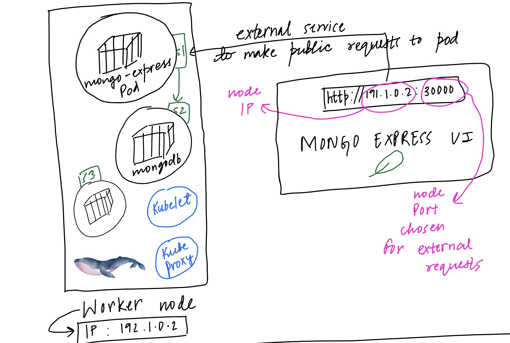
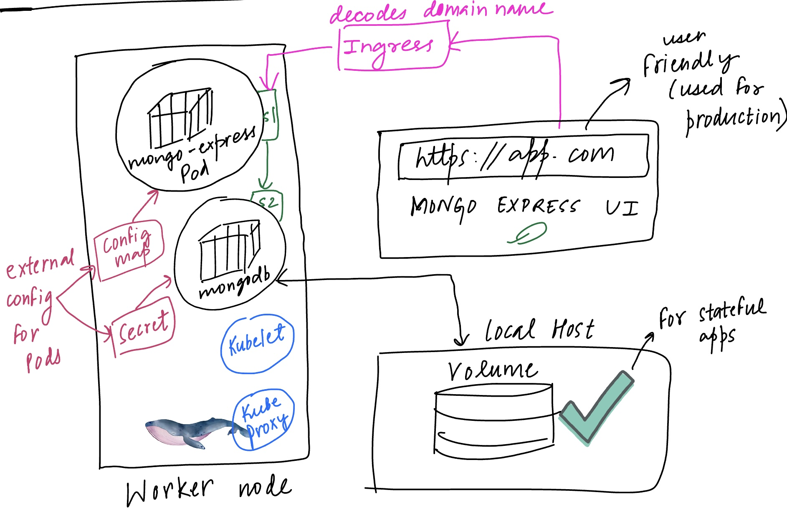
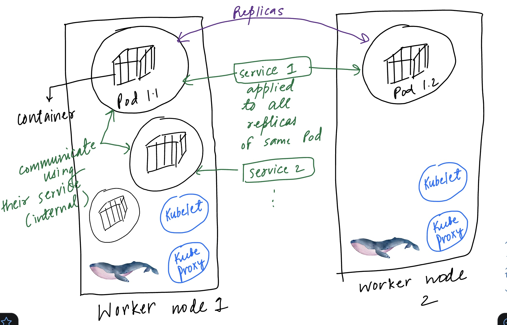
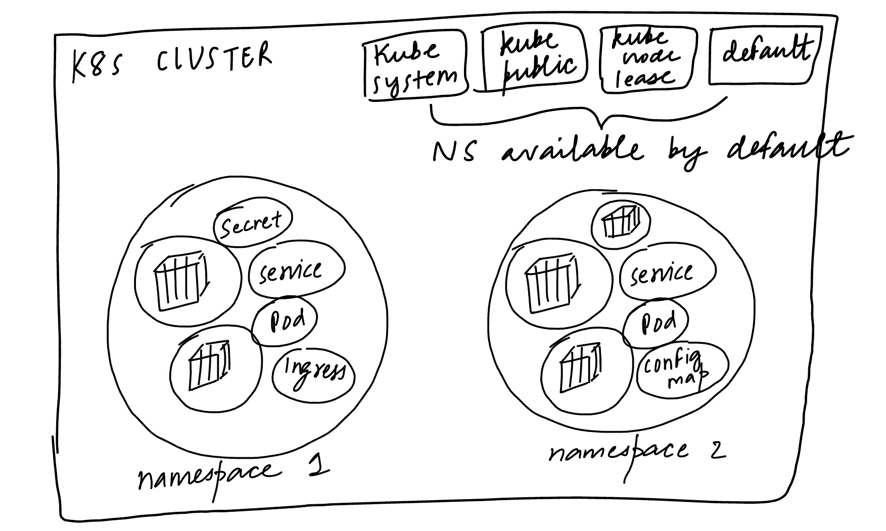

# K8s Components

### Node and Pods

A **node/worker node** is simply a server or a VM on which you app container would run.

**Pod** is the smallest unit of K8s and is an abstraction over the container. It means that regardless of which container like Docker you are using to run your app we will only interact with the Kubernetes layer i.e. the at the Pod level.

### Service and Ingress

Now each Pod has an IP address with which it can communicate with the other Pods. But if somehow a Pod dies due to some app failure then in that case we have to replace it with another pod with a different IP which complicates things since we have to connect with that pod again and again using a different IP. So to remove that issue we have a permanent IP address solution called as a **service**. Since lifecycle of a service has no connection with the pod's lifecycle the endpoints remain the same.

There are 4 main types of services:

* **ClusterIP Services**
* **Headless services** -> clusterIP set to none so that on doing DNS lookup we can get IP addresses of all pods under that service. This is useful when we want to directly connect with a pod or pods have to connect to each other without having to use a service.
* **NodePort services ->** not secure ****&#x20;
* **LoadBalancer services ->** extension of nodePort service which is an extension of clusterIP service

Now to connect from the browser to this app running on the node we need an **external service** like this `http://node-ip:node-port` but this is not good for the end product so instead we want a service like this `https://domain-name` which is easier to remember. So we use **Ingress** to make a request on this url and it then does port forwarding accordingly.

Also we don’t want to connect to a Pod that runs our database or something confidential on a public request hence for it we have an **internal service**.

<figure><figcaption><p>Service to connect with pod containers</p></figcaption></figure>

### ConfigMap and Secret

Let’s say there’s an app running inside your Pod which has access to another Pod running your database using its service. Now if by any chance that service endpoint changes then we would have to make those changes for the url in the app itself and rebuild the image and again deploy it to the repository to finally run it. This is a tedious task since the url is generally available inside the build image only.

So to avoid this we have an external config inside the node which is called **ConfigMap** that has the service url you need and you can access it as an env variable or a properties file inside your pod. But this is not useful for storing passwords or any information that should be hidden from users since the ConfigMap has textual information not encoded in any form. Hence for that reason we have another config called **Secrets** which is base64 encoded and is used to store the secret information like passwords needed by your pod.

### Volumes

If database pod is restarted it will lose all its logged data and hence we need a way to persist it. So we use volumes which are either local meaning we have a replica of the pod data inside the K8s cluster on some hard drive or we have some remote storage option where the data is being stored outside the cluster maybe using some cloud service, etc. So basically K8s doesn’t manage your data instead you are the one responsible for handling it.

3 main components:

1. **Persistent volumes:** used to persist data locally or remotely but we prefer remote storage due to 2 reasons: one that it’s not tied to one specific node and second that it can survive cluster crashes.
2. **PV Claim:** K8s admin will manage all resources and K8s user will use those resources depending on the needs of the application. Now if a pod has to use any volume it will request with PV claim. Claim will try to find a volume in cluster and then allots it to the pod.
3. **Storage class:** used to dynamically provision PV from cloud provider. Pod claims storage via PVC. PVC requests storage from SC. SC creates PV that meets the needs the claim.

<figure><figcaption></figcaption></figure>

### Deployment

If your app fails due to some unknown reason then in that case we have to create a backup such that users can still access the app. For this reason we have a replica of the pod in another node to which our service will connect since service also behaves as a **load balancer**.

This replica is maintained/created with the help of deployments. **Deployment** is an abstraction of pods hence we can say that we don’t directly interact with pods but instead create deployments that will create pods for us. In the deployment we can specify how many replicas of the pods we need. Deployment can also be considered as a blueprint for pods.

<figure><figcaption></figcaption></figure>

### StatefulSet

Now what if the DB fails. In that case also we need a replica but it’s not easy to maintain it since both will have access to the persistent data being stored in our cluster we have to manage synchronisation and hence we use **StatefulSet** instead of deployments.

StatefulSet for stateful apps or databases. Whereas we use Deployments for stateless apps. But since using StatefulSet is not that easy hence we prefer keeping database out of the K8s cluster so that we only have to rely on Deployments for creating the replica sets for our stateless apps.

Here replica pods are not identical. **Each has a pod identity.**

The first replica is called the master which has both read and write access to database and rest of the replicas that are made later will only have read access to avoid data inconsistencies. Each pod has a separate storage which is kept in synchronisation with the master. Also each new replica is made from the previous pod. So in a way we are achieving here temporary storage without using persistent volumes But if all pods die then all data would be lost.

Each new pod is created only if the previous one is up and running. Also while deleting these pods we start from end. Once last one is deleted only then we move to next one.

Since each pod here has a sticky identity hence even if it gets replaced its identity will be same so that it has same roles as the previous pod. The name of each pod is given as:

> (StatefulSet name - ordinal number) like set-0, set1, etc

&#x20;Also it has a fixed individual DNS name for service. Hence on pod restart name and endpoint remains same which helps in retaining state and role of the pod.

### Namespaces

They have 4 main use cases:

1. Structure all different components
2. Avoid conflicts between teams (overwriting deployment made by other team because of same name can be avoided if put into different namespaces)
3. Share services between different environments (reuse components in a particular namespace)
4. Access and resource limits on namespace level

By default there are 4 namespaces:

1. kube-system -> shouldn't be created/modified. Has all kubectl process related components.
2. kube-public -> publicly accessible data, a configMap contains cluster info which can be accessed using command "kubectl cluster-info"
3. &#x20;kube-node-lease -> has heartbeats of nodes, each node has associated lease object in namespace, determines availability of node
4. default -> resources we create are by default here

#### Features of namespaces

1. You can't access most resources from another namespace
2. Only service is the only component that can be shared across namespaces
3. Some components can't be namespaced like volumes and node.

To get list of all components that can be namespaced write the following command:&#x20;

```bash
kubectl api-resources -namespaced=true
```

Add namespace in metadata part of config file for a component:

```yaml
...
metadata:
    name: ...
    namespace: my-namespace
```

<figure><figcaption></figcaption></figure>
